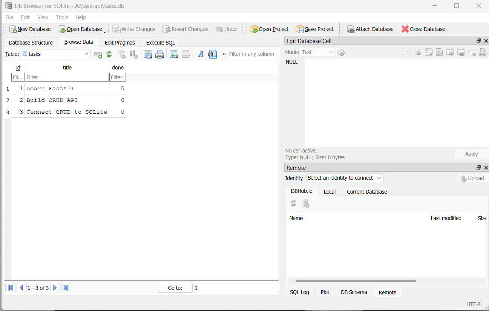

# Task Management API

A persistent CRUD API built with **Python**, **FastAPI**, and **SQLite**.

This project started as an in-memory CRUD API and was upgraded to use a real SQLite database as part of the **FlyRank Internship — Backend Development Track, Week 3, Assignment A2**.

The API keeps the same CRUD endpoints and behavior while storing tasks persistently in `tasks.db`, allowing task data to survive server restarts.

## Features

* Create tasks
* Get all tasks
* Get a single task
* Update tasks
* Delete tasks
* SQLite database persistence
* Automatic database and table creation
* Automatic seeding of three example tasks
* Parameterized SQL queries
* Input validation
* Proper HTTP status codes
* Interactive Swagger UI documentation

## Requirements

* Python 3.14+
* FastAPI
* SQLite

SQLite is included with Python, so no separate database server or SQLite installation is required.

## Why SQLite?

SQLite was chosen for this project because it provides a simple way to add persistent database storage without requiring a separate database server.

### Zero Configuration

SQLite is serverless and requires no database server setup or configuration.

### Single-File Storage

The entire database is stored in a single file:

```text
tasks.db
```

### Persistence

Unlike the original in-memory implementation, task data is stored on disk and survives application restarts.

This makes the API behave like a real database-backed application while keeping the setup simple.

## Database

The database is automatically created when the application starts.

### Database Location

```text
tasks.db
```

The database file is created in the project root and is included in `.gitignore`.

This means a fresh clone does not need an existing database file. When the application is started, SQLite creates the database automatically.

### Database Schema

The database contains one table named `tasks`.

| Column  | Type                  | Description                                       |
| ------- | --------------------- | ------------------------------------------------- |
| `id`    | `INTEGER PRIMARY KEY` | Unique task identifier                            |
| `title` | `TEXT NOT NULL`       | Task title                                        |
| `done`  | `BOOLEAN NOT NULL`    | Completion status, stored by SQLite as `0` or `1` |

### Seed Data

When the application starts, it checks whether the `tasks` table is empty.

If it is empty, three example tasks are inserted:

```text
1. Learn FastAPI
2. Build CRUD API
3. Connect CRUD to SQLite
```

The seed data is inserted only when the table contains zero rows, so restarting the application does not duplicate the example tasks.

## Installation

Clone the repository:

```powershell
git clone https://github.com/sameer0212-dev/task-api.git
cd task-api
```

Create a virtual environment:

```powershell
py -m venv .venv
```

Activate the virtual environment:

```powershell
.venv\Scripts\Activate.ps1
```

Install the dependencies:

```powershell
pip install "fastapi[standard]"
```

## Running the API

Start the development server:

```powershell
fastapi dev main.py
```

The API will be available at:

```text
http://127.0.0.1:8000
```

Interactive Swagger UI:

```text
http://127.0.0.1:8000/docs
```

On startup, the application automatically:

1. Creates `tasks.db` if it does not exist.
2. Creates the `tasks` table if it does not exist.
3. Checks whether the table is empty.
4. Seeds the three example tasks only when the table is empty.

No manual database setup is required.

## API Endpoints

| Method | Endpoint           | Description       | Success |
| ------ | ------------------ | ----------------- | ------- |
| GET    | `/`                | API information   | 200     |
| GET    | `/health`          | Health check      | 200     |
| GET    | `/tasks`           | Get all tasks     | 200     |
| GET    | `/tasks/{task_id}` | Get a single task | 200     |
| POST   | `/tasks`           | Create a new task | 201     |
| PUT    | `/tasks/{task_id}` | Update a task     | 200     |
| DELETE | `/tasks/{task_id}` | Delete a task     | 204     |

The CRUD endpoints retain the same request and response behavior as the original A1 implementation. Only the underlying storage layer was changed from an in-memory list to SQLite.

## Example Requests

### Create a Task

```json
{
  "title": "Learn SQL"
}
```

### Update a Task

```json
{
  "title": "Master SQL",
  "done": true
}
```

## HTTP Status Codes

| Status Code | Meaning                   |
| ----------- | ------------------------- |
| 200         | Successful request        |
| 201         | Task created successfully |
| 204         | Task deleted successfully |
| 400         | Invalid request           |
| 404         | Task not found            |
| 422         | Validation error          |

## Parameterized SQL

Database operations use parameterized SQL queries rather than inserting user-provided values directly into SQL strings.

For example:

```python
cursor.execute(
    "SELECT * FROM tasks WHERE id = ?",
    (task_id,)
)
```

The `?` placeholder keeps the SQL statement separate from the value supplied by the user.

This approach is used throughout the CRUD database operations.

## SQL Example

One query used while exploring the database in DB Browser for SQLite was:

```sql
SELECT id, title, done
FROM tasks
WHERE done = 0;
```

This returns all tasks that are currently marked as incomplete.

## Database Browser

The SQLite database can be opened using **DB Browser for SQLite** to inspect the `tasks` table and its rows directly.

### Database Screenshot



Changes made directly to the database can be observed through the API because both the API and DB Browser are working with the same `tasks.db` file.

## Persistence

The database-backed implementation allows task data to survive server restarts.

For example:

```text
Create task
     ↓
Task stored in tasks.db
     ↓
Stop server
     ↓
Start server again
     ↓
Task is still available
```

This is the main difference between the original A1 implementation and this database-backed version.

## Project Structure

```text
task-api/
│
├── main.py
├── database.py
├── tasks.db              # Generated automatically; git-ignored
├── db_screenshot.png
├── swagger.png
├── README.md
├── .gitignore
└── .venv/                # Local virtual environment; git-ignored
```

### `main.py`

Contains the FastAPI application, API routes, request models, validation, and HTTP behavior.

### `database.py`

Contains the SQLite database connection, table initialization, and initial seed logic.

### `tasks.db`

The SQLite database file containing the persistent task data. It is generated automatically and excluded from Git.

## Testing Persistence

To verify persistence:

1. Start the API.
2. Create a new task using `POST /tasks`.
3. Stop the server.
4. Start the server again.
5. Run `GET /tasks`.
6. Confirm that the created task is still present.

The data remains because it is stored in SQLite rather than an in-memory Python list.

## Git Commits

The project was developed incrementally across the assignment stages, with a separate commit for each completed stage:

```text
Stage 0: create SQLite database
Stage 1: database read endpoints
Stage 2: insert into database
Stage 3: update and delete with SQL
Stage 4: explored SQLite
Stage 5: database documentation
```

## Assignment

**FlyRank Internship — Backend Development Track**

**Week 3 — Assignment A2: Connecting your CRUD to the database**

The project demonstrates the migration of a CRUD API from in-memory storage to persistent SQLite storage while keeping the API contract unchanged.
