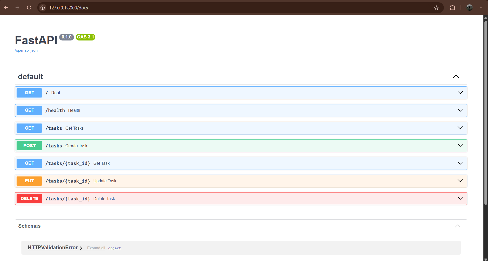

# Task API

A simple CRUD API built with Python and FastAPI.

This API manages a to-do list and supports creating, reading, updating, and deleting tasks.

## Features

- Create tasks
- Get all tasks
- Get a single task
- Update tasks
- Delete tasks
- Input validation
- Proper HTTP status codes
- Interactive Swagger UI documentation

## Requirements

- Python 3.14+
- FastAPI

## Installation

Clone the repository:

```bash
git clone https://github.com/sameer0212-dev/task-api.git
cd task-api
```

Create a virtual environment:

### Windows PowerShell

```powershell
py -m venv .venv
```

Activate the virtual environment:

```powershell
.venv\Scripts\Activate.ps1
```

Install the dependencies:

```powershell
pip install "fastapi[standard]"
```

## Running the API

Start the development server:

```powershell
fastapi dev main.py
```

The API will be available at:

```text
http://127.0.0.1:8000
```

Interactive Swagger documentation:

```text
http://127.0.0.1:8000/docs
```

## API Endpoints

| Method | Endpoint | Description | Success |
|---|---|---|---|
| GET | `/` | API information | 200 |
| GET | `/health` | Health check | 200 |
| GET | `/tasks` | Get all tasks | 200 |
| GET | `/tasks/{task_id}` | Get a single task | 200 |
| POST | `/tasks` | Create a new task | 201 |
| PUT | `/tasks/{task_id}` | Update a task | 200 |
| DELETE | `/tasks/{task_id}` | Delete a task | 204 |

## Example Requests

### Create a Task

```json
{
  "title": "Learn FastAPI"
}
```

### Update a Task

```json
{
  "title": "Master FastAPI",
  "done": true
}
```

## HTTP Status Codes

| Status Code | Meaning |
|---|---|
| 200 | Successful request |
| 201 | Task created successfully |
| 204 | Task deleted successfully |
| 400 | Invalid request |
| 404 | Task not found |
| 422 | Validation error |

## curl Example

The following command checks the root endpoint:

```powershell
curl.exe -i http://localhost:8000/
```

```text
HTTP/1.1 200 OK
date: Mon, 17 Aug 2026 07:55:13 GMT
server: uvicorn
content-length: 58
content-type: application/json

{"name":"Task API","version":"1.0","endpoints":["/tasks"]}
```

## Swagger UI

The API includes automatically generated interactive documentation using FastAPI's Swagger UI.



## Project Structure

```text
task-api/
├── main.py
├── README.md
├── swagger.png
├── .gitignore
└── .venv/
```

The `.venv/` directory is excluded from Git using `.gitignore`.

## Notes

This project currently uses an in-memory list to store tasks.

Because the tasks are stored in memory, all task data will be lost when the server restarts.

# Task Management API (SQLite Backed)

A persistent RESTful CRUD API built with **FastAPI** and **SQLite**, created for FlyRank Internship Week 3 (Assignment A2).

## Why SQLite?
SQLite was chosen for this project because:
- **Zero Configuration:** Runs as a self-contained, serverless engine requiring no database server setup.
- **Single-File Storage:** The entire database resides in a lightweight file (`tasks.db`).
- **Persistence:** Replaces in-memory storage so task data survives application restarts.

## Database Setup & Architecture
- **Location:** `tasks.db` (auto-created on app startup and listed in `.gitignore` so each clone starts fresh).
- **Schema:**
  - `id`: `INTEGER PRIMARY KEY`
  - `title`: `TEXT NOT NULL`
  - `done`: `BOOLEAN NOT NULL`

## How to Run
1. Activate your virtual environment:
   ```powershell
   .venv\Scripts\activate